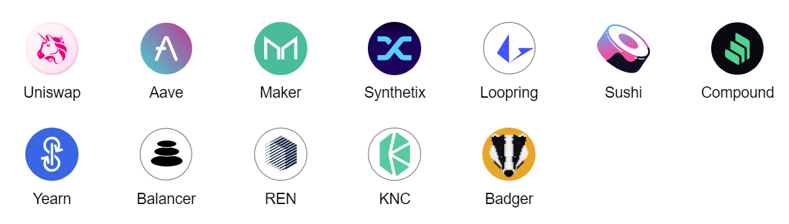
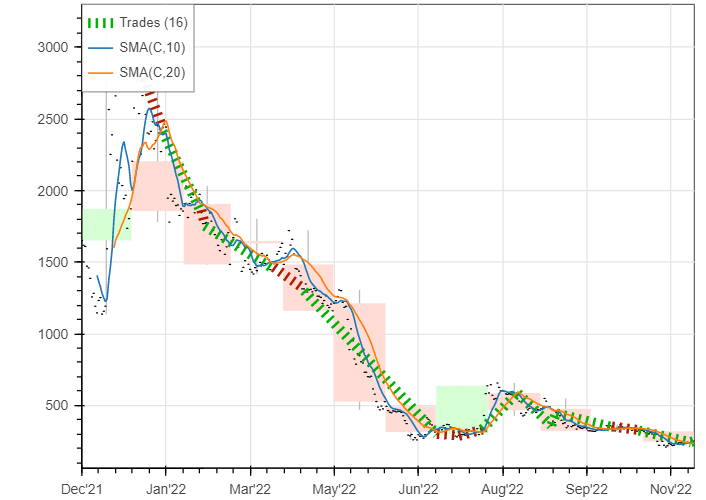
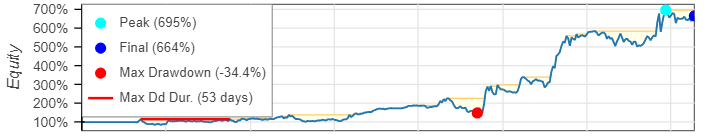

# DeFi ETF

This is a vanilla DeFi ETF implemented as a cap-weighted index of the top market cap assets
on the Ethereum blockchain. 
This index reveals a simple yet diversified exposure to the field of DeFi.

## Disclaimer

A person who gives financial advice is called a financial advisor and takes money for his duties. I share this project for free and thus have nothing to do with any type of financial advice. Remember that this project serves for educations purposes only!

## Tokens included

To appear in this index, the token must satisfy the following criteria:

- exist on the Ethereum blockchain;
- must be in the top-10 according to the market-cap;
- is NOT a wrapped token or/and NOT a derivative or/and NOT a stablecoin.

The default set of the tokens included in the ETF mimics the infamous [DeFi Pulse Index](https://indexcoop.com/defi-pulse-index-dpi#:~:text=The%20DeFi%20Pulse%20Index%20is,of%20each%20token's%20circulating%20supply.).

However, feel free to build your own set by passing a list of tokens to the CLI tool, e.g.,

`
'["uniswap", "yearn-finance",...]'
`

Make sure that the names of the tokens you define remain consistent with the Coingecko token ids.

## Token's Composition

The tokens are weighted based on their market capitalization. 
For sake of simplicity, the total market capitalization of the chosen assets was computed on the daily basis.
Then, the weight of each asset was acquired as a ratio of the market capitalization of a particular token over the total market capitalization on that day.
In the end, the "etf price" was calculates as the sum of the price of each token multiplied by the corresponding weight.
The rebalancement of the weights was done daily.

## Trading Strategy

To compare and evaluate different investment strategies, [the Python Backtester](https://kernc.github.io/backtesting.py/) is used. 
In the default algorithm, two simple strategies were compared:

a) buy & hold;

b) [moving-average crossover](https://en.wikipedia.org/wiki/Moving_average_crossover).

Backtesting was done on the previous 365 days. Surprisingly, the MA crossover strategy showed over 600% annual returns 
with Sharpe ratio equal to 0.68. In the meantime, a vanilla "buy & hold" would achieve -89% over the same period.

P.S. Due to [a known bug](https://github.com/kernc/backtesting.py/issues/803) in Bokeh the plotting doesn't work in PyCharm.
Hence, there is a Notebook to reproduce the plots.

## How to run?

1) Docker;

2) Venv.

## ToDo

- extend the readme on docker & venv;
- implement unit tests for the remaining utils;
- extend the list of assets (there are some assets missing);
- implement another trading strategy;
- fix the plotting issue;
- implement the network and exchange fees when rebalancing;
- fix the bash script for arbitrary assets.

## How to contribute?

Pull requests are welcome!
Please consider openning an issue first and include proper testing into your PR.

## License

[MIT](https://choosealicense.com/licenses/mit/)